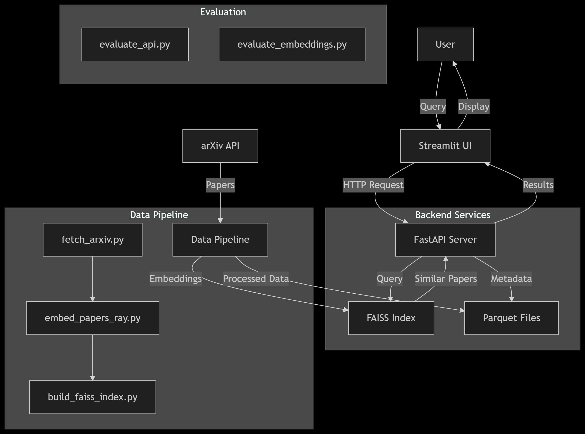

# 📚 Research Paper Recommendation System

[](https://www.python.org/)
[](https://fastapi.tiangolo.com/)
[](https://streamlit.io/)

This projects demonstrates ways to employ distributed processing to handle large scale datasets in ML systems, maintaining scalability and low latency.
An end-to-end ML pipeline that recommends academic papers using embeddings and FAISS similarity search, deployed with FastAPI and Streamlit.



## 🚀 Key Features

- **ArXiv Paper Fetcher**: Downloads recent papers by category
- **Distributed Embeddings**: Processes 10,000+ papers in parallel using Ray
- **FAISS Indexing**: Enables millisecond-level similarity searches
- **Evaluation Framework**: Measures precision@k and recall
- **Production Deployment**: FastAPI backend + Streamlit UI

## 📊 Performance Metrics

| Evaluation Type | Precision@5 | Latency |
|----------------|------------|---------|
| Embedding Space | 0.601      | -       |
| API Endpoint   | 0.840      | 2.1s    |

## 🛠️ Tech Stack

**Core Components**
- **Data Processing**: Pandas, NumPy
- **ML Models**: SPECTER (allenai/specter)
- **Vector Search**: FAISS
- **API**: FastAPI
- **UI**: Streamlit

**Infrastructure**
- Distributed Computing: Ray
- Caching: Redis (optional)
- Deployment: Docker (optional)

## 📦 Installation

### Prerequisites
- Python 3.9+
- GPU recommended for embedding generation

```bash
# Clone repository
git clone https://github.com/yourusername/research-paper-recommender.git
cd research-paper-recommender

# Create virtual environment
python -m venv venv
source venv/bin/activate  # Linux/Mac
venv\Scripts\activate     # Windows

# Install dependencies
pip install -r requirements.txt
```
---

## 🏃‍♂️ Running the System

1. Data Pipeline

```bash
# Fetch papers (saves to papers.parquet)
python fetch_arxiv.py --max_results 1000

# Generate embeddings (requires GPU)
python embed_papers_ray.py --input papers.parquet --output paper_embeddings_ray.parquet

# Build FAISS index
python build_faiss_index.py --input paper_embeddings_ray.parquet --output faiss_index
```

2. Start API Server

```bash
uvicorn api.main:app --reload
```

3. Launch Web UI
```bash
streamlit run app.py
```

## 🧪 Evaluation

```bash
# Evaluate embedding quality
python evaluate_embeddings.py

# Test API endpoint
python evaluate_api.py
```

